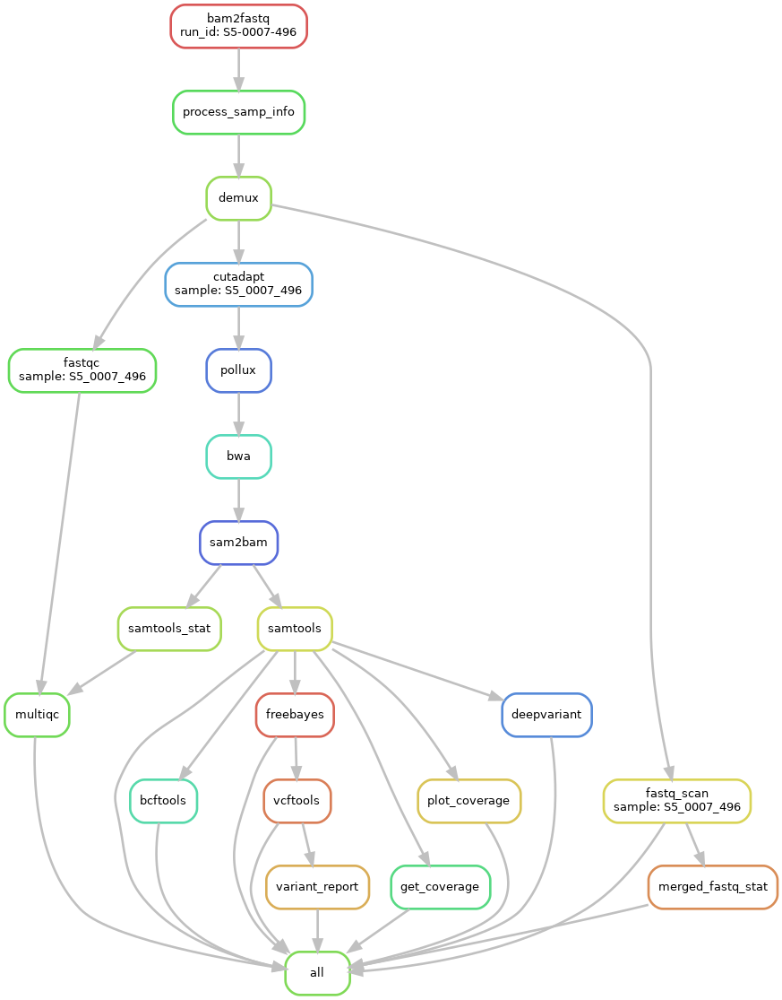
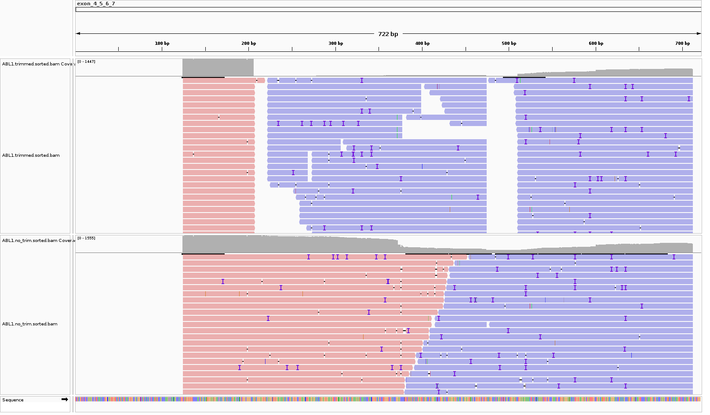
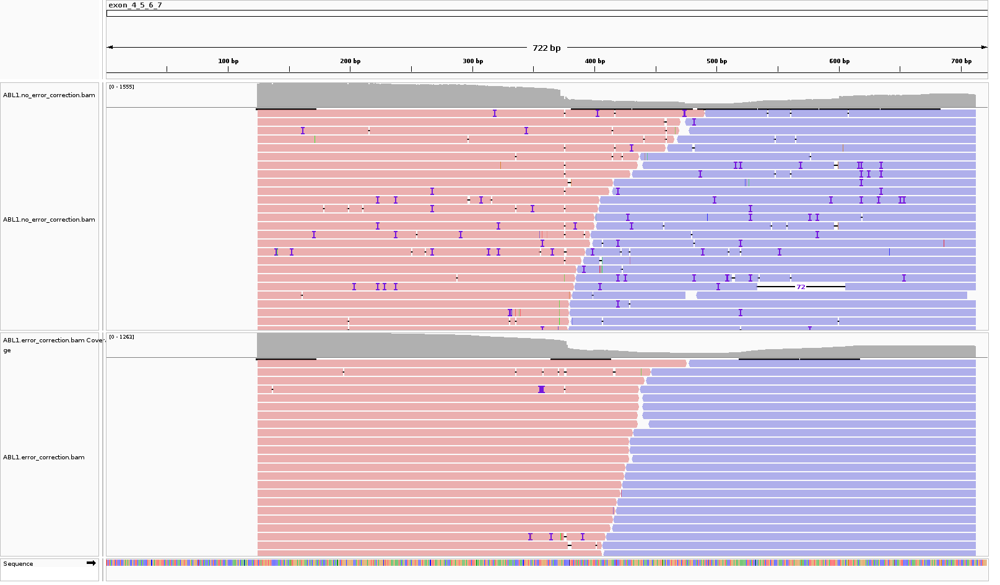
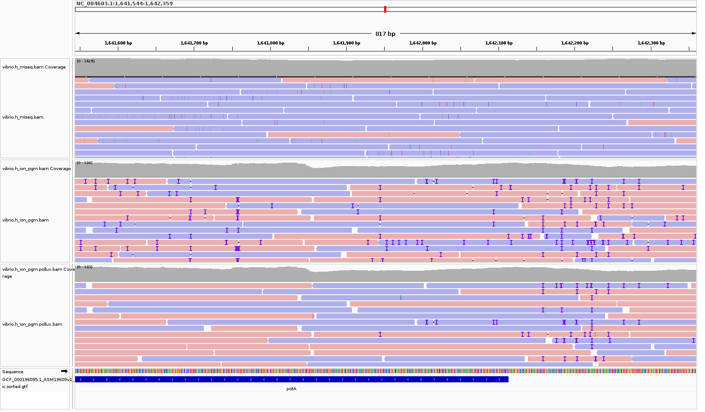

# Exon 4 to 10 of ABL1 variant calling workflow

## Description
Identify variants in exon 4 to 10 of ABL1.

----

## Expected input/output files

- Input files
  1. Unmatched bam
  2. barcode (sequences) and sample info table

- Output files
  1. filtered vcf files 
  2. raw vcf files by freebayes, bcftools and deepvariant
  3. raw fastq files stat - Fastqc and multiqc
  4. bam files for IGV


## Configuration


- go to `ubam` directory and create a `run-id` directory
  - e.g. `ubam` -> `S5-0007-496`
- copy `unmatched bam` in the run folder
- create a sample meta info.csv in the run folder
  - e.g.
  
|row|sample_id     |barcode|
|---|--------------|-------|
|1  |6806006070_DL |420    |
|2  |1_per_minor_qc|421    |
|3  |690702015_DO  |422    |
|4  |1_per_major_qc|423    |

- go to `config` folder and update `configs.yaml`. You should/may want to change the following configuration.

```
run_id:
  "S5-0007-496"

ubam:
  "nomatch_rawlib.basecaller.bam"

sample_info_csv:
  "sample_info.csv"

default_barcodes:
  "configs/barcodes.tsv"

barcode:
  "configs/barcodes.tsv"
```

Now try `snakemake -npr`. This is a dry-run command. See what it says. If you see an error message, you may want to change your configuration settings.

## Overview of the workflow

1. Demultiplex
2. QC steps
   - run fastqc on sample.fastq files
   - trim adapter sequences using cutadapt and discard reads are shorter than `200 bp`.
   - <del> filtering out low quality of reads (discard reads having avg quality score <= 20)
3. Correct short indel errors using [Pollux](https://bmcbioinformatics.biomedcentral.com/articles/10.1186/s12859-014-0435-6)
4. Align reads to the reference genome (exon 4 to 9 of ABL1)
5. Filter out reads have supplementary alignment in bam files and MAPQ >= 20 - keep only primary alignment reads
6. Call variants using freebayes, bcftools and deepvariant
   - Most of reads are marked as duplicate reads due to the fact we use amplicon sequencing. So the workflow will skip the marking duplicate reads step.
7. Filter out vcf files using cutoff from vcf files generated by freebayes.
   - Includes only sites with Quality value above this threshold.
   - Exclude all genotypes with a quality below the threshold specified.


   
Note, if you'd like to see the DAG of the job scheduling, the command below will produce a visual of the jobs for you.

```snakemake --dag | dot -Tpng > workflow.png```



----

### Comparison of quality trimmed/no trimmed reads
There are two gaps that no reads mapped to the reference genome in the trimmed reads panel in IGV. On the other hand, when we didn't do quality trimming, all of the targeted regions (exon 4 to 7) were covered. 



### Correction of short indel errors
We can see that there are many short indels in IGV. Since Ion torrent machines are suject to short indel errors (homoploymer errors), we performed sequence error corection using [Pollux](https://bmcbioinformatics.biomedcentral.com/articles/10.1186/s12859-014-0435-6).



### Comparison of Miseq and Ion torrent sequencing data using public data
Public data obtained from [Performance comparison of second-and third-generation sequencers using a bacteria genome with two chromosomes](http://www.biomedcentral.com/1471-2164/15/699). 

The researchers sequenced `vibrio parahaemolyticus RIMD2210633` using a Miseq and Ion torrent machine.

This is a screen shot of IGV showing Miseq reads alignment, Ion torrent reads alignment without error correction and Ion torrent reads alignment with error correction in IGV respectively.



[sequencing data link](https://www.ncbi.nlm.nih.gov/sra?linkname=bioproject_sra_all&from_uid=259437)

Assuming Illumina sequencers are more accurate and robust to homopolymer errors, there are very few indes identified in miseq data. But there are many short indels detected in Ion torrent data.

`Compared to the Illumina platforms, the Ion Proton platform has a high ratio of false positives in the identification of small insertion and
deletion mutations (indel) but shows high accuracy in the identification of single nucleotide variant (SNV).`

[SHIRO F, et al, 2017: Single nucleotide variant sequencing errors in whole exome sequencing using the Ion Proton System](https://www.ncbi.nlm.nih.gov/pmc/articles/PMC5492560/)

### Homoploymer definition
Stretches of the same nucleotide sequence, also known as homopolymer stretches.

from Thermo fisher PGM manual

----
## How to run the pipeline


This is a dry run. `snakemake -npr`. 

If the standard output looks expected, run `snakemake -j 1 # of job`.

Example `snakemake -p -j1 --use-singularity  --singularity-args "-B //media/hd1/jkim/genome/ABL1_NM005157.4/index/ucsc/hg19/bwa//://media/hd1/jkim/genome/ABL1_NM005157.4/index/ucsc/hg19/bwa/"`

----

## Build the reference genome

### Object
Build a reference genome only having exon 4~7 from ABL1 gene

### How to build the reference genome
1. get `hg19.fa` and correspond gtf - `refGene_05_14.2020.txt`

   - `md5sum refGene_05_14.2020.txt` is `7d87863aa84702725c44af5302708f47`
   - `md5sum hg19.fa` is `d6851f9f4537ff4e9beb5b7a08b89230`
2. `python3 src/extract_exons.py -t NM_005157.4 --exon_nums 4 5 6 7`
3. `python3 src/squish_fa.py -i output/NM_005157.fa -o NM_005157_exons_4_to_7`

   - We will obtain `NM_005157_exons_4_to_7.fa` in `output` folder
4. Build indexes for your alignment tools `bwa or bowtie2`

### Requirement

`python3` >= 3.7
`bedtools`
`pandas`
`bwa`/`bowtie2`

### Python scripts Usage
**bedtools can do this. Use bedtools**

example

`bedtools getfasta -fi hg19.fa -fo exon_4_to_10 -name -bed NM_005157.gtf`

`python3 extract_exons.py -h`

example

`python3 extract_exons.py -t NM_xxxx --exon_nums 4 5 6 7`

### Output
- `NM_xxxx.fa`
- `NM_xxxx.bed`
- `NM_xxxx.fa.bak`
 
`NM_xxxx.fa` has sequences of the exons chosen by users

After running `extract_exons.py` I also ran `squish.py` to merge the `header/sequences` from the fa file.

#### Note
`NM_xxxx.bed` file has exon info which looks like the table below.

When you look at those loci in IGV, +1 should be added to the exon_start.


| chr | exon_start | exon_end  | exon_num |
|:----|:-----------|:----------|:---------|
| chr9| 133738149  | 133738422 | 4        |
| chr9| 133747515  | 133747600 | 5        |
| chr9| 133748246  | 133748424 | 6        |
| chr9| 133750254  | 133750439 | 7        |

Exon location in the ref_fasta.

| exon_name | start | end |
| --------- | ----- | --- |
| exon4     | 1     | 273 |
| exon5     | 274   | 358 |
| exon6     | 359   | 536 |
| exon7     | 537   | 721 |


## Requirement

How to install the required tools below?? `conda? docker?`

`Python version >= 3.7`

`bedtools`

`pandas`

`snakemake`

`fastqc`

`samtools`

`bwa-mem`

`pollux`

`picard`

`singularity`